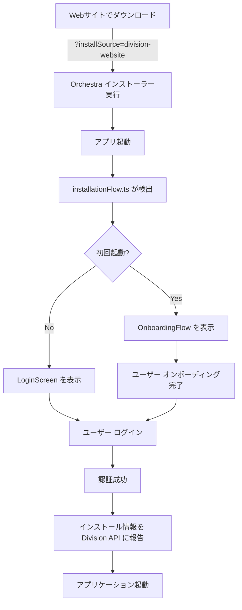

# Division.he-ro.jp との統合ガイド

## 概要

このドキュメントは、**division.he-ro.jp** から Orchestra をダウンロード・インストール可能にするための実装ガイドです。

## Webサイト側の実装

### 1. ダウンロードリンク

Webサイト（division.he-ro.jp）のダウンロードページで、以下のようなリンクを提供します：

```html
<!-- Linux x64 -->
<a href="https://github.com/he-ro-corp/orchestra/releases/download/latest/Orchestra-linux-x64.zip?installSource=division-website">
	Linux 版をダウンロード
</a>

<!-- macOS ARM64 -->
<a href="https://github.com/he-ro-corp/orchestra/releases/download/latest/Orchestra-darwin-arm64.dmg?installSource=division-website">
	macOS 版をダウンロード
</a>

<!-- Windows x64 -->
<a href="https://github.com/he-ro-corp/orchestra/releases/download/latest/Orchestra-win32-x64.exe?installSource=division-website">
	Windows 版をダウンロード
</a>
```

### 2. カスタムプロトコルハンドラー（オプション）

Orchestra がインストール済みの場合、カスタムプロトコルで直接起動することができます：

```html
<a href="orchestra://open?source=division-website">
	Orchestra を起動
</a>
```

**実装例（Electron で対応）**:

```typescript
// src/vs/code/electron-main/app.ts
app.setAsDefaultProtocolClient('orchestra');

app.on('open-url', (event, url) => {
	event.preventDefault();
	const params = new URL(url).searchParams;
	const source = params.get('source') || 'unknown';
	
	// urlパラメータに渡して、アプリ内で処理
	mainWindow?.webContents.send('install-source', source);
});
```

### 3. インストール後のコールバック

ユーザーがダウンロード後、インストーラーが完了すると自動的に Orchestra が起動します。アプリの起動時に、URL パラメータ `?installSource=division-website` を検出してオンボーディングフローを表示します。

```
division.he-ro.jp
    ↓
[ダウンロードボタン]
    ↓
?installSource=division-website パラメータ付きで起動
    ↓
Orchestra アプリ起動
    ↓
installationFlow.ts が検出
    ↓
OnboardingFlow.tsx を表示
```

## Webサイト側のマークアップ例

### ダウンロードセクション

```html
<section class="downloads">
	<h2>Orchestra をダウンロード</h2>
	<p>最強のマルチエージェント AI IDE を今すぐ始めましょう</p>

	<div class="download-buttons">
		<!-- macOS -->
		<div class="platform">
			<h3>macOS</h3>
			<p class="desc">Apple Silicon (M1/M2/M3) & Intel 対応</p>
			<div class="buttons">
				<a href="https://github.com/he-ro-corp/orchestra/releases/download/latest/Orchestra-darwin-arm64.dmg?installSource=division-website" 
					class="btn btn-primary">
					macOS (ARM64) をダウンロード
				</a>
				<a href="https://github.com/he-ro-corp/orchestra/releases/download/latest/Orchestra-darwin-x64.dmg?installSource=division-website" 
					class="btn btn-secondary">
					macOS (Intel) をダウンロード
				</a>
			</div>
		</div>

		<!-- Windows -->
		<div class="platform">
			<h3>Windows</h3>
			<p class="desc">Windows 10 以降</p>
			<a href="https://github.com/he-ro-corp/orchestra/releases/download/latest/Orchestra-win32-x64.exe?installSource=division-website" 
				class="btn btn-primary">
				Windows (x64) をダウンロード
			</a>
		</div>

		<!-- Linux -->
		<div class="platform">
			<h3>Linux</h3>
			<p class="desc">Ubuntu, Debian, Fedora など</p>
			<a href="https://github.com/he-ro-corp/orchestra/releases/download/latest/Orchestra-linux-x64.zip?installSource=division-website" 
				class="btn btn-primary">
				Linux (x64) をダウンロード
			</a>
		</div>
	</div>

	<div class="install-info">
		<h4>インストール後</h4>
		<ol>
			<li>ダウンロードしたファイルを実行</li>
			<li>Orchestra が自動起動</li>
			<li>Division アカウントでログイン</li>
			<li>マルチエージェント AI を活用開始</li>
		</ol>
	</div>
</section>
```

### CSS 例

```css
.downloads {
	max-width: 1200px;
	margin: 40px auto;
	padding: 40px 20px;
	border-radius: 12px;
	background: linear-gradient(135deg, #f5f5f5 0%, #e8e8e8 100%);
}

.download-buttons {
	display: grid;
	grid-template-columns: repeat(auto-fit, minmax(300px, 1fr));
	gap: 30px;
	margin: 30px 0;
}

.platform {
	background: white;
	padding: 30px;
	border-radius: 8px;
	box-shadow: 0 2px 8px rgba(0, 0, 0, 0.1);
	text-align: center;
}

.platform h3 {
	margin: 0 0 8px;
	font-size: 24px;
	font-weight: bold;
	color: #333;
}

.platform .desc {
	margin: 0 0 20px;
	font-size: 14px;
	color: #666;
}

.buttons {
	display: flex;
	flex-direction: column;
	gap: 10px;
}

.btn {
	display: inline-block;
	padding: 12px 24px;
	border-radius: 6px;
	font-weight: 600;
	text-decoration: none;
	transition: all 0.3s ease;
	cursor: pointer;
}

.btn-primary {
	background-color: #dc2626;
	color: white;
}

.btn-primary:hover {
	background-color: #b91c1c;
	transform: translateY(-2px);
	box-shadow: 0 4px 12px rgba(220, 38, 38, 0.3);
}

.btn-secondary {
	background-color: #e5e7eb;
	color: #333;
}

.btn-secondary:hover {
	background-color: #d1d5db;
}

.install-info {
	background: white;
	padding: 20px;
	border-radius: 8px;
	margin-top: 30px;
	border-left: 4px solid #dc2626;
}

.install-info h4 {
	margin-top: 0;
	color: #dc2626;
}

.install-info ol {
	margin: 10px 0;
	padding-left: 20px;
}

.install-info li {
	margin: 8px 0;
	color: #333;
}
```

## インストール検証

### 正常なインストール確認フロー



## トラッキング・分析

### インストール源の追跡

Webサイト側でインストール元を追跡するには、以下の JavaScript を使用できます：

```javascript
// division.he-ro.jp のダウンロードページ
document.querySelectorAll('a[href*="Orchestra"]').forEach(link => {
	link.addEventListener('click', (e) => {
		// インストール開始イベントを記録
		gtag('event', 'orchestra_download', {
			platform: link.dataset.platform,
			source: 'division-website',
			timestamp: new Date().toISOString()
		});
	});
});
```

### Division API 側での統計

`supabase/functions/report-installation/index.ts` でインストール情報を収集し、以下の統計を取得できます：

- インストール元別のユーザー数
- インストール日時別の傾向
- バージョン別の採用率
- OSプラットフォーム別の分布

## トラブルシューティング

### インストール元が検出されない

1. URLパラメータが正しく渡されているか確認
   ```
   ?installSource=division-website
   ```

2. ブラウザのキャッシュをクリア

3. デベロッパーコンソールでローカルストレージを確認
   ```javascript
   console.log(localStorage.getItem('division:installationState'));
   ```

### インストーラーが実行されない

- OS のセキュリティ警告を許可
- インストール権限を確認
- アンチウイルスの除外リストに追加

## セキュリティとプライバシー

- インストール情報は暗号化して保存
- 個人情報は収集しない（ユーザーID のみ）
- GDPR/日本の個人情報保護法に準拠

---

**作成日**: 2025-08-03  
**バージョン**: 1.0.0  
**著作権**: He-ro Corporation
